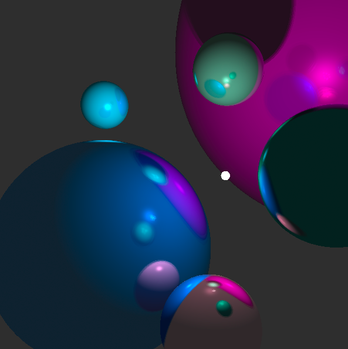
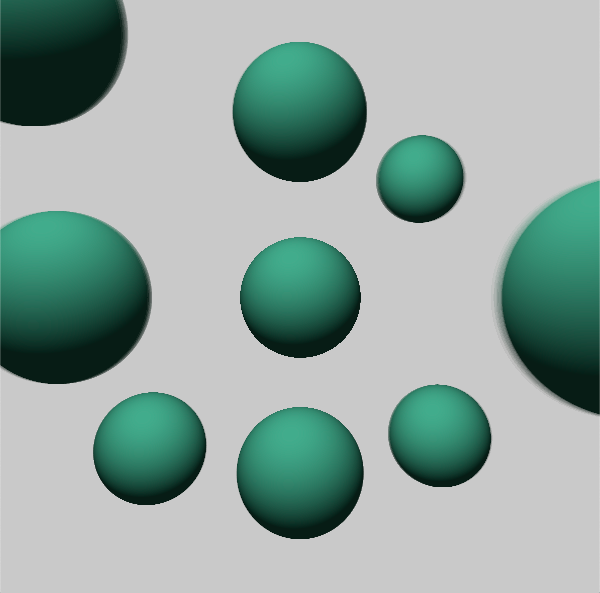

ЭФФЕКТЫ
  Сцена 1:
    отбрасывание тени на другие объекты(1 балл)
    зеркальные грани(1 балл)
    объемный источник освещения(3 балла)
    нечеткие тени(3 балла)
    нечеткие отражения(4 балла)
    попиксельный расчет освещенности по стандартным моделям(1 балл)
  Сцена 2:  
  переменная глубина резкости(2 балла)
  
  Итого: 15 баллов
  
УСТАНОВКА И ЗАПУСК
   Язык: Python
   В работе использованы библиотеки Pillow, Image, tqdm и math
   Проект написан в Jupyter Notebook
   
Сцена 1:
  
Сцена 2:
  
   
